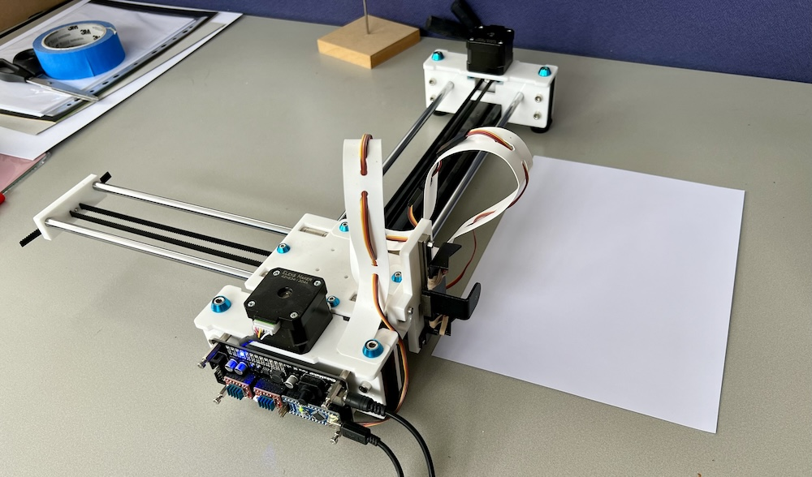

# Install

    pipx install "vpype[all]"
    pipx inject vpype vpype-occult
    pipx inject vpype vpype-gcode

# Run

    ./svg-to-gcode examples/a4-portrait.inkscape.svg

# Tips for working with Jackie’s A4 pen plotter

Jackie’s pen plotter is an A4 EleksMaker EleksDraw, controlled by an ESP Nano v3.0 board.

You may need to install a driver on your computer for it to communicate with the USB-to-serial chip on the ESP Nano.

The EleksDraw has a printable area of 200mm by 270mm. You should send it Gcode files in portrait orientation, with artwork extending no more than 200mm across from 0,0 and 270mm up from 0,0.

## Prepare the EleksDraw

It is easiest to orient the EleksDraw with its control board facing towards you, so that you can see the lights on the board, and so that the head is near to you when you want to change the pen:

1. Begin by pushing the carriage as far as it will go towards you, and the pen holder all the way to the left, as shown above.
2. You may want to stick the EleksDraw down onto the tabletop, to prevent it being accidentally bumped out of position relative to the paper.
3. Secure a pen into the pen holder.
4. Position your A4 paper under the pen, and fix it to the tabletop, to prevent it moving as the pen drags over it.

Depending on your artwork, you may want to position the bottom left corner of the paper directly under the pen, or you may want the pen to start partway into the sheet. Remember, though, the pen cannot move more than 200mm right, or 270mm up, from the start point!

## Prepare your artwork

Convert your SVG file to Gcode using `./svg-to-gcode`.

Your Gcode file should contain X coordinates no higher than 200mm and Y coordinates no higher than 270mm.

If your SVG artwork is landscape, you may want to rotate it into portrait orientation, eg:

    ./svg-to-gcode foo.svg -t "rotate -o 0 0 90 layout -h right -v top a4"

## Start plotting

1. Connect the EleksDraw to power (this will illuminate a blue light in position D4 on the EleksMaker board) and connect the ESP Nano to your computer with a USB cable (this will illuminate a green PWR light on the ESP Nano).
2. Open Universal Gcode Sender (UGS), and connect to the EleksMaker using the GRBL protocol at 115200 baud. (The connection port will differ based on your computer’s OS – on a Mac, it begins with `cu.usbserial`.)
3. Open your Gcode file.
4. “Reset Zero” in UGS.
5. Send your Gcode file to the plotter.
